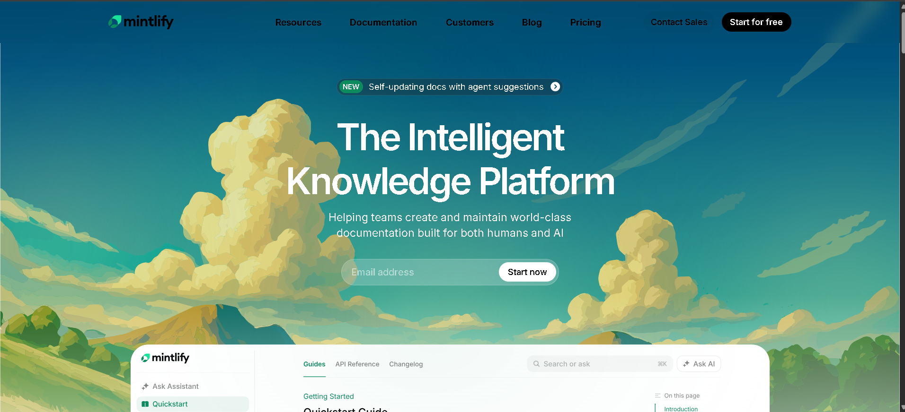
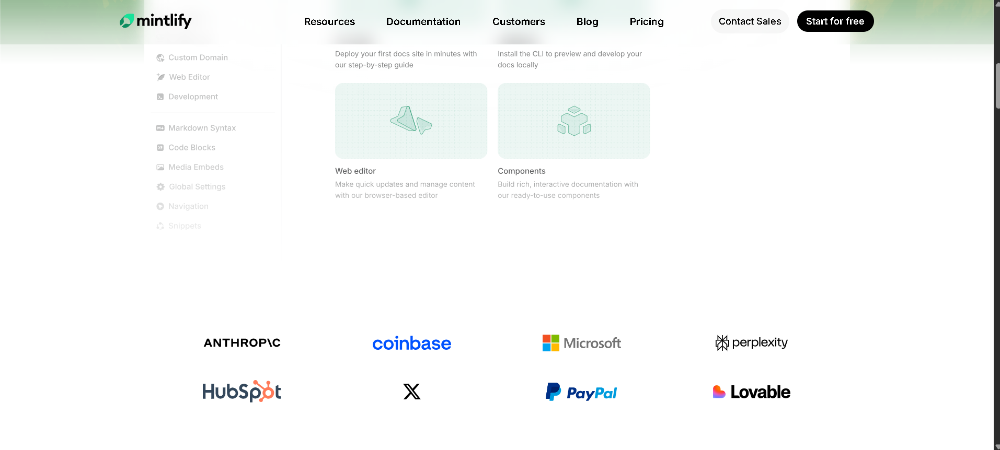

# Mentlify Landing Page clone 
- Create using html and css only.

## How to setup this project locally ? 

- Run this command into your terminal: 
`git clone https://github.com/Sameer-ts-tech/mintlify-landing-page.git`
- Once the repo gets cloned then run the project with live server

### live link

[mentlify-landing-page](https://mentlify-landing-page.netlify.app/)